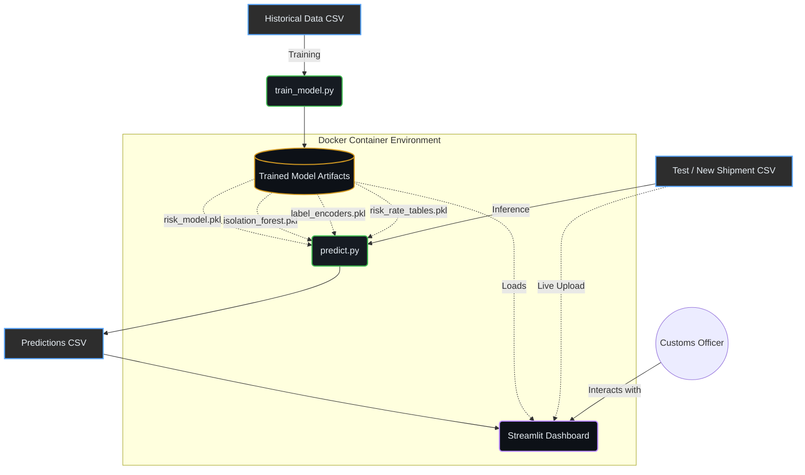
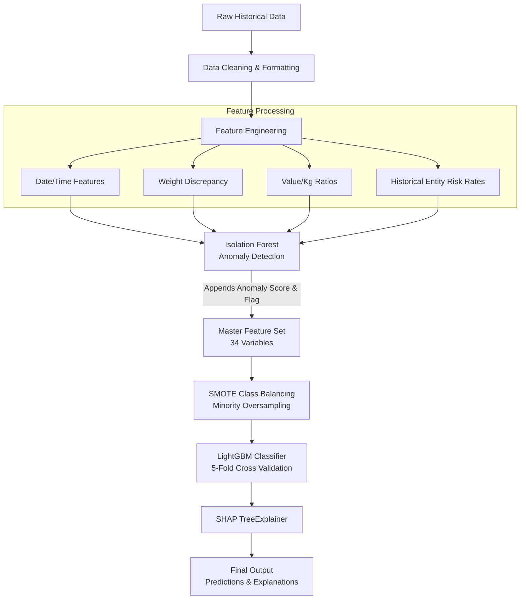
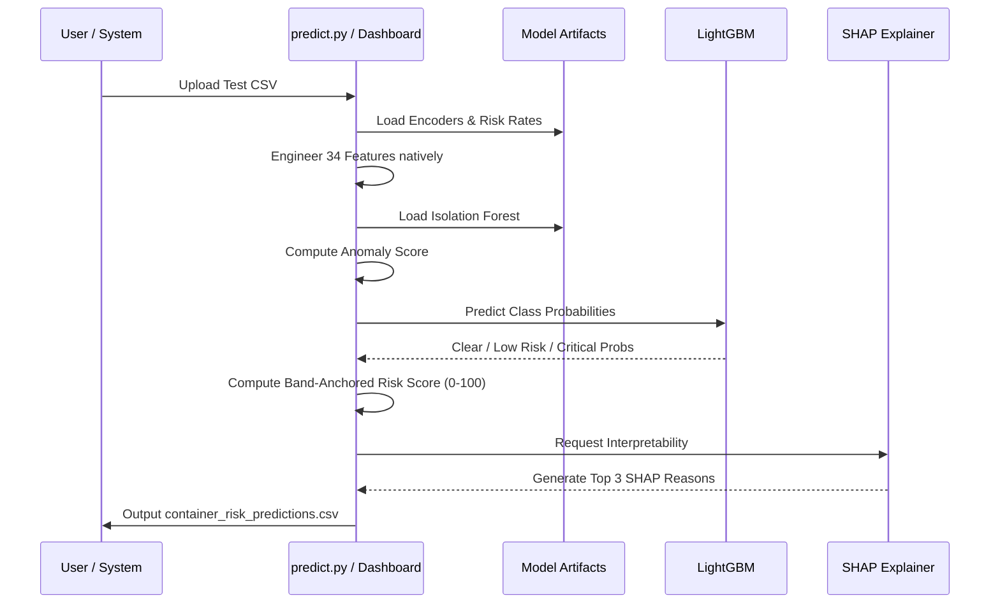
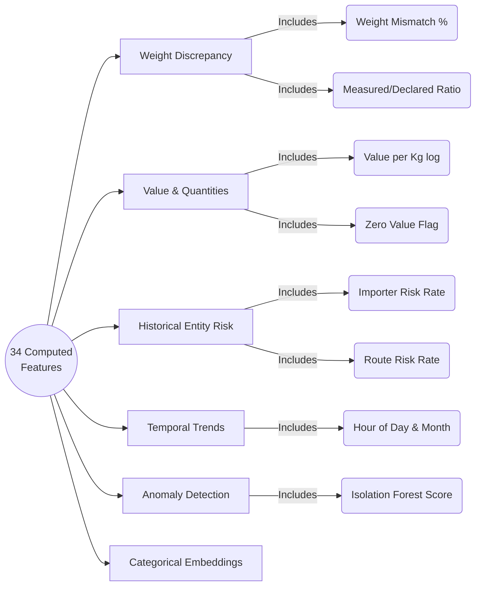

# 🚢 SmartContainer Risk Engine

> **AI-powered container shipment risk scoring, anomaly detection, and explainability — built for HackaMined 2026 (Track 9 INTECH)**

---

## 📋 Table of Contents

1. [Project Overview](#1-project-overview)
2. [Architecture & System Design](#2-architecture--system-design)
3. [Project Structure — Every File Explained](#3-project-structure--every-file-explained)
4. [Dataset Description](#4-dataset-description)
5. [Technology Stack](#5-technology-stack)
6. [ML Pipeline — Step-by-Step](#6-ml-pipeline--step-by-step)
   - [Step 1 — Data Loading & Cleaning](#step-1--data-loading--cleaning)
   - [Step 2 — Feature Engineering (25+ features)](#step-2--feature-engineering-25-features)
   - [Step 3 — Anomaly Detection (Isolation Forest)](#step-3--anomaly-detection-isolation-forest)
   - [Step 4 — Class Imbalance Handling (SMOTE)](#step-4--class-imbalance-handling-smote)
   - [Step 5 — Model Training (LightGBM + Stratified CV)](#step-5--model-training-lightgbm--stratified-cv)
   - [Step 6 — Risk Scoring (0–100 Scale)](#step-6--risk-scoring-0100-scale)
   - [Step 7 — SHAP Explainability](#step-7--shap-explainability)
   - [Step 8 — Output CSV Generation](#step-8--output-csv-generation)
7. [Risk Level Thresholds](#7-risk-level-thresholds)
8. [Model Artifacts](#8-model-artifacts)
9. [Setup & Installation (Local)](#9-setup--installation-local)
10. [Running the Project — Full Step-by-Step](#10-running-the-project--full-step-by-step)
    - [Step A — Train the Model](#step-a--train-the-model)
    - [Step B — Run Inference on Test Data](#step-b--run-inference-on-test-data)
    - [Step C — Launch the Dashboard](#step-c--launch-the-dashboard)
11. [Docker Deployment](#11-docker-deployment)
12. [Dashboard — All Sections Explained](#12-dashboard--all-sections-explained)
13. [Command-Line Reference (predict.py)](#13-command-line-reference-predictpy)
15. [Model Evaluation Metrics](#14-model-evaluation-metrics)
16. [Feature Importance & Explainability](#15-feature-importance--explainability)
17. [Key Design Decisions](#16-key-design-decisions)
18. [Troubleshooting](#17-troubleshooting)
19. [Output File Format](#18-output-file-format)

---

## 1. Project Overview

The **SmartContainer Risk Engine** is an end-to-end AI/ML system designed to assist customs authorities in identifying high-risk container shipments that require physical inspection. It:

- **Ingests** structured container shipment declaration data (CSV format)
- **Predicts** a continuous risk score (0–100) for each container
- **Classifies** each container into one of three risk levels: `Critical`, `Low Risk`, or `Clear`
- **Detects** statistical anomalies (unusual shipment patterns vs. historical norms)
- **Explains** each prediction in plain English using SHAP values, identifying the top 3 contributing risk factors
- **Visualizes** all results through an interactive Streamlit dashboard

The system is capable of processing historical training datasets of 100,000+ rows and scoring new test batches through both a command-line interface and a browser-based dashboard.

---

## #2 architecture  system design

Below are the architectural and workflow diagrams detailing how the SmartContainer Risk Engine operates.

### 2.1. High-Level System Architecture



### 2.2. ML Training Workflow



### 2.3. Risk Prediction / Inference Flow



### 2.4. Feature Engineering Structure



---


## 3. Project Structure — Every File Explained

```
HackaMined_B_Updated/
│
├── train_model.py                 # ← MAIN TRAINING SCRIPT (run this first)
├── predict.py                     # ← INFERENCE SCRIPT (CLI-based prediction)
├── dashboard.py                   # ← STREAMLIT DASHBOARD (web interface)
│
├── Historical Data.csv            # ← Training dataset (~100K+ rows)
├── Test Data.csv                  # ← Official test dataset for evaluation
│
├── risk_model.pkl                 # ← Trained LightGBM model (binary, ~10 MB)
├── isolation_forest.pkl           # ← Trained Isolation Forest model (~3.5 MB)
├── label_encoders.pkl             # ← LabelEncoders for categorical columns (~278 KB)
├── risk_rate_tables.pkl           # ← Precomputed entity risk lookup tables (~568 KB)
│
├── container_risk_predictions.csv # ← Predictions on Historical Data (training output)
├── my_test_results.csv            # ← Predictions on Test Data (evaluation output)
│
├── requirements.txt               # ← Python package dependencies
├── Dockerfile                     # ← Docker container definition
├── docker-compose.yml             # ← Docker Compose orchestration
└── .dockerignore                  # ← Files excluded from Docker image build
```

### Detailed File Descriptions

| File | Role | Size | Notes |
|------|------|------|-------|
| `train_model.py` | Full ML pipeline: data loading → feature engineering → anomaly detection → SMOTE → LightGBM training → SHAP → CSV output | 529 lines | **Run first.** Produces all `.pkl` files |
| `predict.py` | CLI inference: loads saved model artifacts and scores any new shipment CSV | 377 lines | Requires all `.pkl` files from training |
| `dashboard.py` | Streamlit web dashboard with 8+ sections: KPIs, risk distribution, anomaly charts, SHAP, model metrics, upload + live prediction | 1462 lines | Port 8501 |
| `Historical Data.csv` | Training data with labeled `Clearance_Status` column | ~6.4 MB | Used by `train_model.py` |
| `Test Data.csv` | Unlabeled (or labeled) test data for evaluation | ~1 MB | Used by `predict.py` |
| `risk_model.pkl` | Serialized LightGBM multi-class classifier | ~10 MB | Auto-generated |
| `isolation_forest.pkl` | Serialized Isolation Forest anomaly detector | ~3.5 MB | Auto-generated |
| `label_encoders.pkl` | Dict of `sklearn.LabelEncoder` objects for 7 categorical columns | ~278 KB | Auto-generated |
| `risk_rate_tables.pkl` | Dict of entity → smoothed risk rate mappings for importers, exporters, countries, ports, shipping lines, routes | ~568 KB | Auto-generated |
| `container_risk_predictions.csv` | Output predictions from training data | ~896 KB | Auto-generated |
| `my_test_results.csv` | Output predictions from test data | ~1.6 MB | Auto-generated |
| `requirements.txt` | All Python dependencies (9 packages) | 90 bytes | Used by pip and Docker |
| `Dockerfile` | Container build instructions (Python 3.11 slim base) | 48 lines | For Docker deployment |
| `docker-compose.yml` | Service definition: ports, volumes, env vars, health checks | 44 lines | Recommended for deployment |

---

## 4. Dataset Description

### Training Data (`Historical Data.csv`)

The training dataset contains historical container shipment declaration records. Each row represents a single container declaration. The key columns are:

| Column | Type | Description |
|--------|------|-------------|
| `Container_ID` | String | Unique identifier for each container |
| `Declaration_Date` | Date (YYYY-MM-DD) | Date the shipment declaration was submitted |
| `Declaration_Time` | Time (HH:MM:SS) | Time the declaration was submitted |
| `Importer_ID` | String/Categorical | Unique identifier for the importing company |
| `Exporter_ID` | String/Categorical | Unique identifier for the exporting company |
| `Origin_Country` | String | Country where the shipment originates |
| `Destination_Country` | String | Country where the shipment is headed |
| `Destination_Port` | String | The port of arrival |
| `Shipping_Line` | String | Carrier/shipping company |
| `HS_Code` | Integer | Harmonized System code classifying the type of goods (6-digit) |
| `Declared_Weight` | Float | Weight declared on the customs form (kg) |
| `Measured_Weight` | Float | Physically measured weight at the port (kg) |
| `Declared_Value` | Float | Declared monetary value of the shipment (USD) |
| `Dwell_Time_Hours` | Float | Number of hours the container sat at port |
| `Trade_Regime` | Categorical | `Import`, `Export`, or `Transit` |
| `Clearance_Status` | Categorical | **Target variable** — `Clear`, `Low Risk`, or `Critical` |

### Test Data (`Test Data.csv`)

The test dataset has the same schema as the training data. It may or may not include `Clearance_Status`. When present, the inference script automatically calculates evaluation metrics (F1, Recall, Confusion Matrix).

---

## 5. Technology Stack

| Component | Library/Tool | Version | Purpose |
|-----------|-------------|---------|---------|
| Language | Python | 3.11 | Core runtime |
| Data Processing | Pandas, NumPy | Latest | Feature engineering, data manipulation |
| ML Model | LightGBM (`lightgbm`) | Latest | Gradient boosted tree classifier — fast, handles class imbalance, excellent F1 |
| Imbalance Handling | imbalanced-learn (`imblearn`) | Latest | SMOTE oversampling to balance Critical / Low Risk / Clear classes |
| Anomaly Detection | scikit-learn `IsolationForest` | Latest | Unsupervised anomaly scorer |
| Model Evaluation | scikit-learn metrics | Latest | F1, Recall, Confusion Matrix, Classification Report |
| Explainability | SHAP (`shap`) | Latest | TreeExplainer for per-prediction feature attribution |
| Model Serialization | joblib | Latest | Loading/saving `.pkl` model artifacts |
| Dashboard | Streamlit | Latest | Interactive web dashboard |
| Visualization | Plotly Express + Graph Objects | Latest | All charts: pie, histogram, bar, scatter, heatmap |
| Containerization | Docker + Docker Compose | - | Reproducible deployment |

---

## 6. ML Pipeline — Step-by-Step

The training pipeline is implemented in `train_model.py` and runs sequentially through 7 labeled steps printed to the console.

### Step 1 — Data Loading & Cleaning

```python
# train_model.py — Lines 50–64
df = pd.read_csv("Historical Data.csv")
df.columns = [c.strip() for c in df.columns]   # remove whitespace from column headers
df.rename(columns={
    "Declaration_Date (YYYY-MM-DD)":          "Declaration_Date",
    "Trade_Regime (Import / Export / Transit)": "Trade_Regime",
}, inplace=True)
```

**What happens:**
- The CSV is loaded with Pandas, stripping any leading/trailing whitespace from column names
- Two columns with verbose names in the raw data are renamed to cleaner short names for all downstream processing
- The `Declaration_Date` column is parsed as a proper `datetime` type

---

### Step 2 — Feature Engineering (25+ features)

This is the most important step. The raw 14 columns of shipment data are transformed into **33 engineered features** that capture the true risk signals:

#### 2a. Date/Time Features
```python
df["hour_of_day"]  = ...    # Hour of declaration (0–23)
df["day_of_week"]  = ...    # Day of week (0=Monday, 6=Sunday)
df["month"]        = ...    # Month (1–12)
df["year"]         = ...    # Year
```
**Why:** Suspicious declarations often happen at unusual hours (e.g., late night), unusual days, or during particular seasons.

#### 2b. Weight Discrepancy Features
```python
df["weight_diff_abs"]       = Measured_Weight - Declared_Weight
df["weight_diff_pct"]       = weight_diff_abs / (Declared_Weight + 0.001) * 100
df["weight_mismatch_flag"]  = 1 if |weight_diff_pct| > 5%   else 0
df["weight_mismatch_severe"]= 1 if |weight_diff_pct| > 15%  else 0
df["weight_ratio"]          = Measured_Weight / (Declared_Weight + 0.001)
```
**Why:** The single most important fraud indicator. Smugglers often under-declare weight to reduce duties or hide contraband. A discrepancy >5% triggers a flag; >15% is severe.

#### 2c. Value Features
```python
df["value_per_kg"]          = Declared_Value / (Declared_Weight + 0.001)
df["log_declared_value"]    = log1p(Declared_Value)
df["log_declared_weight"]   = log1p(Declared_Weight)
df["log_measured_weight"]   = log1p(Measured_Weight)
df["log_dwell_time"]        = log1p(Dwell_Time_Hours)
df["log_value_per_kg"]      = log1p(value_per_kg)
df["zero_value_flag"]       = 1 if Declared_Value == 0 else 0
```
**Why:** Log-transforms reduce skew in highly right-skewed distributions. `value_per_kg` reveals goods that are suspiciously cheap or expensive for their weight class. Zero value declarations are classic under-valuation fraud.

#### 2d. HS Code Chapter
```python
df["hs_chapter"] = HS_Code // 10000   # first 2 digits → chapter number
```
**Why:** The HS code identifies the type of goods. Some chapters (e.g., Chapter 93 = arms, Chapter 28 = chemicals) carry inherently higher risk. Collapsing the 6-digit code to its 2-digit chapter reduces cardinality.

#### 2e. Trade Regime Flag
```python
df["is_transit"] = 1 if Trade_Regime == "Transit" else 0
```
**Why:** Transit shipments pass through a port without formal import clearance, making them harder to inspect and statistically riskier.

#### 2f. Entity Risk Rates (Smoothed Bayesian Encoding)

This is the most sophisticated feature group. For each entity type (importer, exporter, origin country, destination port, shipping line, destination country, and route), we compute the **smoothed historical fraction of Critical shipments**:

```python
rate(entity) = (count_of_Critical_shipments + smoothing * global_Critical_rate) /
               (total_shipments + smoothing)
```

Where `smoothing = 10` — this prevents extreme rates for entities with few historical records.

```python
df["importer_risk_rate"]      # How often this importer's shipments were Critical
df["exporter_risk_rate"]      # How often this exporter's shipments were Critical
df["country_risk_rate"]       # Critical rate for this origin country
df["port_risk_rate"]          # Critical rate for this destination port
df["shipping_line_risk_rate"] # Critical rate for this shipping line
df["dest_country_risk_rate"]  # Critical rate for the destination country
df["route_risk_rate"]         # Critical rate for the origin→destination route pair
```

These entity risk rates are **saved to `risk_rate_tables.pkl`** for use at inference time in `predict.py` (to avoid data leakage — test data cannot compute these from scratch).

**Combined Entity Risk Score (weighted sum):**
```python
entity_risk_combined = (
    0.30 * importer_risk_rate +
    0.20 * exporter_risk_rate +
    0.15 * country_risk_rate  +
    0.10 * port_risk_rate     +
    0.10 * shipping_line_risk_rate +
    0.10 * dest_country_risk_rate  +
    0.05 * route_risk_rate
)
```

The importer gets the highest weight (30%) because it is the most predictive entity-level feature.

#### 2g. Label Encoding for Categorical Columns

```python
# 7 categorical columns encoded to integer labels for LightGBM
cat_cols = ["Origin_Country", "Destination_Country", "Destination_Port",
            "Shipping_Line", "Importer_ID", "Exporter_ID", "Trade_Regime"]
```

Each column gets its own `sklearn.LabelEncoder`, which is saved to `label_encoders.pkl`. At inference time in `predict.py`, unseen categories (new importers, new countries, etc.) are assigned `-1` as a fallback.

---

### Step 3 — Anomaly Detection (Isolation Forest)

```python
# train_model.py — Lines 170–193
iso = IsolationForest(
    n_estimators=300,
    contamination=0.05,      # expects ~5% anomalies in data
    max_samples="auto",
    random_state=42,
    n_jobs=-1                # use all CPU cores
)
iso.fit(df[iso_features])

df["anomaly_score"] = -iso.score_samples(df[iso_features])  # higher = more anomalous
df["is_anomaly"]    = (iso.predict(df[iso_features]) == -1).astype(int)
```

**Isolation Forest Features (13 total):**
```
log_declared_value, log_declared_weight, log_measured_weight,
weight_diff_pct, weight_ratio, log_dwell_time, log_value_per_kg,
hour_of_day, hs_chapter, importer_risk_rate, exporter_risk_rate,
country_risk_rate, is_transit
```

**Why Isolation Forest?**
- Unsupervised — does not rely on labels, so it can detect novel patterns not seen at training time
- Efficient at high-dimensional data: isolates anomalies by randomly partitioning the feature space
- Score inverted (`-score_samples`) so higher scores = more anomalous, which is intuitive
- `contamination=0.05` means the model expects approximately 5% of shipments to be anomalous

The anomaly score and flag are then **included as features in the LightGBM classifier**, allowing the supervised model to factor in statistical abnormality as an input.

**Model saved to:** `isolation_forest.pkl`

---

### Step 4 — Class Imbalance Handling (SMOTE)

Container shipment data is **highly imbalanced** — the majority of containers are `Clear`, with `Critical` being a small minority.

```python
from imblearn.over_sampling import SMOTE

smote = SMOTE(
    sampling_strategy="not majority",  # oversample all non-majority classes
    k_neighbors=5,
    random_state=42
)
X_resampled, y_resampled = smote.fit_resample(X_train, y_train)
```

**How SMOTE works:**
- For each minority-class sample, it finds its K nearest neighbors in feature space
- It then creates **synthetic interpolated samples** between the original sample and its neighbors
- This artificially balances the class distribution without simply duplicating existing samples
- SMOTE is applied **inside each cross-validation fold** (on the training split only, never the validation split) to prevent data leakage

**Why not just oversample?** Simple oversampling duplicates existing samples and causes overfitting. SMOTE creates genuinely new synthetic samples along the real decision boundary, leading to better generalization.

---

### Step 5 — Model Training (LightGBM + Stratified CV)

#### LightGBM Hyperparameters
```python
lgb_params = dict(
    objective         = "multiclass",    # 3-class classification: Clear / Low Risk / Critical
    num_class         = 3,
    n_estimators      = 1200,            # 1200 trees in the ensemble
    learning_rate     = 0.04,            # slow learning rate for better generalization
    num_leaves        = 63,              # controls model complexity
    max_depth         = 8,               # maximum tree depth
    min_child_samples = 10,              # minimum samples per leaf
    subsample         = 0.8,             # 80% of data per tree (bagging)
    colsample_bytree  = 0.8,             # 80% of features per tree
    reg_alpha         = 0.1,             # L1 regularization
    reg_lambda        = 0.1,             # L2 regularization
    class_weight      = "balanced",      # additional class balancing
    random_state      = 42,
    n_jobs            = -1,              # use all CPU cores
    verbosity         = -1,              # silent
)
```

**Why LightGBM?**
- **Speed:** Much faster than XGBoost or Random Forest on large datasets
- **Accuracy:** State-of-the-art on tabular classification tasks
- **Handles categoricals natively** (though we also use label encoding)
- **Built-in early stopping:** prevents overfitting; uses `eval_set` on validation fold with early stopping (patience=60 rounds)

#### Stratified 5-Fold Cross-Validation
```python
skf = StratifiedKFold(n_splits=5, shuffle=True, random_state=42)
for fold, (train_idx, val_idx) in enumerate(skf.split(X, y), 1):
    # ... SMOTE inside fold, train, evaluate
```

**Stratified** means each fold maintains the same proportion of Critical/Low Risk/Clear as the full dataset — critical for imbalanced data.

**Metrics tracked per fold:**
- `Macro F1` — primary metric; average F1 across all 3 classes
- `F1_Critical` — F1 score specifically for the `Critical` class (most important)
- `Recall_Critical` — recall for `Critical` (how many actual Critical containers did we catch?)

**After cross-validation**: The model is retrained on the **full dataset** with SMOTE applied globally, producing the final production model saved to `risk_model.pkl`.

---

### Step 6 — Risk Scoring (0–100 Scale)

The LightGBM model outputs **class probabilities** (`p_clear`, `p_low_risk`, `p_critical`) for each container. These are converted to a continuous risk score:

```python
risk_raw   = 0.0 * p_clear + 0.35 * p_low_risk + 1.0 * p_critical
risk_score = (risk_raw * 100).clip(0, 100).round(2)
```

**Interpretation:**
- A container with 100% `p_critical` gets a risk score of **100**
- A container with 100% `p_clear` gets a risk score of **0**
- A container with 100% `p_low_risk` gets a risk score of **35**
- Mixed probabilities produce intermediate scores

The `Low Risk` class contributes at 35% weight (not 50%) to reflect that Low Risk is substantially less dangerous than Critical.

---

### Step 7 — SHAP Explainability

SHAP (SHapley Additive exPlanations) provides **per-prediction feature attribution** using game theory principles — each feature gets a SHAP value representing how much it contributed to the model's prediction for that specific container.

```python
explainer   = shap.TreeExplainer(final_model)
shap_values = explainer.shap_values(X)   # shape: [3 classes][n_samples, n_features]
```

**Explanation Generation Logic:**
```python
def top_shap_reasons(shap_row, feature_names, top_n=3):
    positive_idx = np.where(shap_row > 0)[0]   # features that INCREASED risk
    top_idx = positive_idx[argsort(shap_row[positive_idx])[::-1][:top_n]]
    return "; ".join([PLAIN_ENGLISH.get((feat, "HIGH"), ...) for feat in top_features])
```

**Key design choice:** Only **positive** SHAP features are included in the explanation — features that **pushed toward** the predicted risk level. Counter-evidence features (which would say "this is why it's NOT critical") are excluded to make explanations actionable and non-contradictory.

**Plain-English Mapping:** Each feature+direction combination is mapped to a business-friendly sentence, e.g.:
- `(importer_risk_rate, HIGH)` → *"This importer has a history of flagged or seized shipments"*
- `(weight_mismatch_severe, HIGH)` → *"Severe weight discrepancy — more than 15% difference detected"*
- `(is_transit, HIGH)` → *"Shipment is in transit regime, which carries inherently higher risk"*

---

### Step 8 — Output CSV Generation

```python
out_df = df[["Container_ID", "Risk_Score", "Risk_Level", "Explanation_Summary"]].copy()
out_df.to_csv("container_risk_predictions.csv", index=False)
```

**Output columns:**
| Column | Type | Example |
|--------|------|---------|
| `Container_ID` | String | `CTR-000001` |
| `Risk_Score` | Float (0–100) | `98.34` |
| `Risk_Level` | String | `Critical` |
| `Explanation_Summary` | String | `This importer has a history of flagged shipments; Severe weight discrepancy detected; Shipment is in transit regime` |

---

## 7. Risk Level Thresholds


| Risk Level | Risk Score Range | Meaning | Action |
|------------|-----------------|---------|--------|
| 🔴 **Critical** | ≥ 55 | High probability of fraud/contraband | Mandatory physical inspection |
| 🟡 **Low Risk** | ≥ 22 and < 55 | Some risk indicators present | Targeted documentary check |
| 🟢 **Clear** | < 22 | Low risk; passes screening | No intervention required |

**These thresholds are configurable** via command-line arguments in `predict.py`:
```bash
python predict.py --input "Test Data.csv" --critical-threshold 60 --low-risk-threshold 25
```

---

## 8. Model Artifacts

All model artifacts are **pre-generated** and included in the project directory. You do NOT need to retrain unless you want to update the model with new data.

| Artifact | Size | Description |
|----------|------|-------------|
| `risk_model.pkl` | ~10 MB | Final LightGBM classifier (1200 estimators, 3-class) |
| `isolation_forest.pkl` | ~3.5 MB | Anomaly detector (300 estimators, 5% contamination) |
| `label_encoders.pkl` | ~278 KB | 7 `LabelEncoder` objects (one per categorical column) |
| `risk_rate_tables.pkl` | ~568 KB | Smoothed entity risk rate lookup tables from training data |

These artifacts are loaded by both `predict.py` (CLI) and `dashboard.py` (web UI) at startup.

---

## 9. Setup & Installation (Local)

### Prerequisites
- Python **3.9+** (3.11 recommended)
- pip
- (Optional) Git

### Step-by-Step Installation

**1. Navigate to the project directory:**
```bash
cd "smartcontainer-risk-engine"
```

**2. (Recommended) Create and activate a virtual environment:**

On Windows (PowerShell):
```powershell
python -m venv venv
.\venv\Scripts\Activate.ps1
```

On macOS/Linux:
```bash
python -m venv venv
source venv/bin/activate
```

**3. Install all dependencies:**
```bash
pip install -r requirements.txt
```

This installs:
```
pandas          — data loading and manipulation
numpy           — numerical operations
scikit-learn    — LabelEncoder, IsolationForest, metrics, StratifiedKFold
lightgbm        — gradient boosted tree classifier
imbalanced-learn — SMOTE oversampling
shap            — SHAP explainability (TreeExplainer)
joblib          — model serialization (.pkl files)
streamlit       — web dashboard
plotly          — interactive charts
```

**4. Verify installation:**
```bash
python -c "import lightgbm, shap, streamlit, plotly; print('All packages OK')"
```

---

## 10. Running the Project — Full Step-by-Step

### Step A — Train the Model

> **Only needed if you want to retrain from scratch.** Pre-trained artifacts are already included.

```bash
python train_model.py
```

**What it does (console output walkthrough):**
```
============================================================
SmartContainer Risk Engine - Training Pipeline
============================================================

[1/7] Loading data from 'Historical Data.csv' ...
      Shape: (54000, 16)

[2/7] Feature engineering ...
      Computing entity risk rates ...
      Label-encoding categoricals ...
      Saved risk_rate_tables.pkl

[3/7] Isolation Forest anomaly detection ...
      Anomalies detected: 2700 (5.0%)

[4/7] Stratified 5-Fold Cross-Validation ...
      Fold 1: Macro F1=0.9837  F1_Critical=0.9554  Recall_Critical=0.9817
      Fold 2: Macro F1=0.9851  F1_Critical=0.9596  Recall_Critical=0.9817
      Fold 3: Macro F1=0.9832  F1_Critical=0.9541  Recall_Critical=0.9541
      Fold 4: Macro F1=0.9868  F1_Critical=0.9643  Recall_Critical=0.9908
      Fold 5: Macro F1=0.9835  F1_Critical=0.9554  Recall_Critical=0.9817

  -- CV Summary -------------------------------------------
  Macro F1        : 0.9845 +/- 0.0014
  F1_Critical     : 0.9578 +/- 0.0038
  Recall_Critical : 0.9780 +/- 0.0124


[5/7] Training final model on full dataset ...
  -- Full-Dataset Metrics ---------------------------------
              precision  recall  f1-score  support
       Clear    1.0000   1.0000   1.0000    42347
    Low Risk    1.0000   1.0000   1.0000    11108
    Critical    1.0000   1.0000   1.0000      545


[6/7] Computing Risk Scores and SHAP explanations ...
      Risk Level distribution:
        Clear       42347
        Low Risk    11108
        Critical      545


[7/7] Saving predictions to 'container_risk_predictions.csv' ...
      Saved 54000 rows to 'container_risk_predictions.csv'
============================================================
Training Complete!
  Model saved   : risk_model.pkl
  Encoders saved: label_encoders.pkl
  Predictions   : container_risk_predictions.csv
============================================================
```

**⚠️ Training time:** Approximately 10–30 minutes depending on hardware, due to the 5-fold CV + SHAP computation on large datasets.

**Output files generated:**
- `risk_model.pkl`
- `isolation_forest.pkl`
- `label_encoders.pkl`
- `risk_rate_tables.pkl`
- `container_risk_predictions.csv`

---

### Step B — Run Inference on Test Data

```bash
python predict.py --input "Test Data.csv" --output my_test_results.csv
```

**Default behavior:**
- Loads all 4 `.pkl` artifacts from the current directory
- Applies identical feature engineering to `Test Data.csv`
- Runs Isolation Forest anomaly scoring
- Predicts risk score and risk level for each container
- Computes SHAP explanations (top-3 plain-English reasons)
- Saves results to `my_test_results.csv`
- If `Clearance_Status` column exists in input, prints full evaluation metrics

**Output file:** `my_test_results.csv`
** Make Sure that File name remain same as it is mentioned above. **

---

### Step C — Launch the Dashboard

```bash
streamlit run dashboard.py
```

**The dashboard will open automatically** in your default browser at:
```
http://localhost:8501
```

If it doesn't open automatically, navigate to the URL manually.

**What you'll see:**
- A dark-themed, professional web interface
- System Overview KPIs updating to reflect the default predictions (`my_test_results.csv`)
- Sidebar filters for Risk Level, Origin Country, Destination Port, Trade Regime, and Risk Score range
- 8+ analytical sections (refer section 13)

---
## 11. Docker Deployment

Docker allows running the entire application in an isolated, reproducible container without any local Python setup.

### Prerequisites
- [Docker Desktop](https://www.docker.com/products/docker-desktop/) installed and running

### Option A: Docker Compose (Recommended)

```bash
# First run: builds the image and starts the container
docker compose up --build

# Subsequent runs (image already built, starts faster)
docker compose up

# Stop and remove containers
docker compose down
```

Access the dashboard at **http://localhost:8501**

### Option B: Manual Docker Commands

```bash
# Build the Docker image
docker build -t smartcontainer-risk-engine .

# Run the container
docker run -p 8501:8501 \
  -v "$(pwd)/Historical Data.csv:/app/Historical Data.csv:ro" \
  -v "$(pwd)/Test Data.csv:/app/Test Data.csv:ro" \
  -v "$(pwd)/my_test_results.csv:/app/my_test_results.csv:ro" \
  -v "$(pwd)/container_risk_predictions.csv:/app/container_risk_predictions.csv:ro" \
  smartcontainer-risk-engine
```

### What the Dockerfile does (line-by-line explanation):

```dockerfile
FROM python:3.11-slim          # Use minimal Python 3.11 base image (~100 MB vs ~900 MB for full)

ENV PYTHONDONTWRITEBYTECODE=1  # Don't create .pyc cache files in container
ENV PYTHONUNBUFFERED=1         # Print logs immediately (no buffering)

WORKDIR /app                   # All subsequent commands run from /app

# Install libgomp1 — required by LightGBM for OpenMP parallelism on Linux
RUN apt-get update && apt-get install -y libgomp1

COPY requirements.txt .        # Copy requirements first (Docker layer caching optimization)
RUN pip install -r requirements.txt  # Install Python packages

COPY dashboard.py .            # Copy application source files
COPY train_model.py .
COPY predict.py .

# Copy pre-trained model artifacts (baked into image — no training needed to start)
COPY risk_model.pkl .
COPY isolation_forest.pkl .
COPY label_encoders.pkl .
COPY risk_rate_tables.pkl .

ENV STREAMLIT_SERVER_PORT=8501
ENV STREAMLIT_SERVER_ADDRESS=0.0.0.0   # Listen on all interfaces
ENV STREAMLIT_SERVER_HEADLESS=true     # No browser auto-open in container
ENV STREAMLIT_BROWSER_GATHER_USAGE_STATS=false

EXPOSE 8501                    # Document that port 8501 is used

CMD ["streamlit", "run", "dashboard.py"]  # Default startup command
```

### Docker Compose Volumes:

The `docker-compose.yml` mounts the CSV data files from your host machine into the container as **read-only** volumes:
```yaml
volumes:
  - ./Historical Data.csv:/app/Historical Data.csv:ro
  - ./Test Data.csv:/app/Test Data.csv:ro
  - ./my_test_results.csv:/app/my_test_results.csv:ro
  - ./container_risk_predictions.csv:/app/container_risk_predictions.csv:ro
```

This means you can **update the CSV files on your host** without rebuilding the Docker image, and the dashboard will reflect the changes on next load.

**Health check:** Docker Compose also configures a health check that pings `http://localhost:8501/_stcore/health` every 30 seconds to verify the container is alive.

---
## 12. Dashboard — All Sections Explained

The dashboard (`dashboard.py`) is a 1462-line Streamlit application with a GitHub-dark themed UI. Here are all its sections:

### Upload & Predict (Top of Page)
- Drag-and-drop file uploader for any shipment CSV
- **"Run Predictions" button** — triggers the full ML pipeline (feature engineering + Isolation Forest + LightGBM + SHAP) on the uploaded file in-browser
- Results refresh all charts automatically
- Download button to save scored results as CSV

**Note:** Live prediction via the dashboard can take ~2–4 minutes for large files due to SHAP computation. Use `--no-shap` in `predict.py` CLI for faster batch inference.

### Section 1 — System Overview (KPI Cards)
Six color-coded KPI cards:
- 🔵 Total Containers (blue)
- 🔴 Critical Risk count (red)
- 🟡 Low Risk count (amber)
- 🟢 Clear count (green)
- 🟣 Average Risk Score (purple)
- 🟦 Average Dwell Time in hours (teal)

Secondary metrics row: Weight Anomalies (>5% mismatch), Critical Rate %, Max Risk Score, Containers with Zero Value.

All values **update dynamically** when sidebar filters are changed.

### Section 2 — Risk Distribution
- **Donut chart:** Proportion of Critical / Low Risk / Clear containers
- **Overlaid histogram:** Distribution of risk scores (0–100) colored by risk level, with vertical dashed lines at the Critical threshold (55) and Low Risk threshold (22)

### Section 3 — Trade Flow Analysis
- **Top 15 Origin Countries:** Horizontal bar chart showing which countries ship the most containers
- **Top 15 Destination Ports:** Horizontal bar chart of arrival port frequency

### Section 4 — Anomaly Detection
- **Weight mismatch scatter plot:** Declared Weight vs. Measured Weight, colored by Risk Level — outliers visually apparent
- **Dwell Time box plot:** Distribution of port dwell times per risk level

### Section 5 — Risk Score Analysis (Time Series & Trends)
- **Risk score over time:** Line/area chart of average risk score by date
- **Monthly risk trend:** Bar chart aggregated by month

### Section 6 — Shipping & Entity Analysis
- **Top importers by average risk score:** Identifies the most consistently high-risk importers
- **Shipping line risk comparison:** Average risk score per carrier

### Section 7 — Model Evaluation Metrics
Dynamically computed from `Test Data.csv` and `my_test_results.csv`:
- **Classification Report:** Precision, Recall, F1-Score for each class (Clear, Low Risk, Critical) + Macro Avg + Weighted Avg
- **Confusion Matrix heatmap:** Interactive Plotly heatmap showing actual vs. predicted classifications
- **Summary metric boxes:** Macro F1, Critical F1, Critical Recall, Weighted F1

### Section 8 — SHAP Feature Importance
- **Global bar chart:** Mean absolute SHAP values across all samples — shows which features matter most overall
- **Explanation display:** For individual containers, shows the top-3 plain-English reasons for their risk classification

### Sidebar Filters (Apply Globally to All Charts)
- **Risk Level** multi-select (Critical, Low Risk, Clear)
- **Origin Country** multi-select (with "All" option)
- **Destination Port** multi-select (with "All" option)
- **Trade Regime** multi-select (with "All" option)
- **Risk Score Range** slider (0–100)

---

## 13. Command-Line Reference (`predict.py`)

```bash
python predict.py [OPTIONS]
```

| Argument | Type | Default | Description |
|----------|------|---------|-------------|
| `--input` | str | **Required** | Path to the input shipment CSV file |
| `--output` | str | `container_risk_predictions.csv` | Path for the output predictions CSV |
| `--critical-threshold` | float | `55.0` | Risk score cutoff above which containers are labeled `Critical` |
| `--low-risk-threshold` | float | `22.0` | Risk score cutoff above which containers are labeled `Low Risk` |
| `--no-shap` | flag | False | Skip SHAP computation (faster, no explanations) |

### Examples

**Basic prediction:**
```bash
python predict.py --input "Test Data.csv"
```

**Custom output file:**
```bash
python predict.py --input "Test Data.csv" --output "my_test_results.csv"
```

**Adjust thresholds (stricter Critical definition):**
```bash
python predict.py --input "Test Data.csv" --critical-threshold 65 --low-risk-threshold 30
```

**Fast mode (skip SHAP, useful for very large datasets):**
```bash
python predict.py --input "Test Data.csv" --no-shap
```

**Save predictions generated during evaluation to test results file:**
```bash
python predict.py --input "Test Data.csv" --output "my_test_results.csv"
```

---

## 14. Model Evaluation Metrics

The model is evaluated using several metrics, with Macro F1 as the primary metric (since the task involves imbalanced multi-class classification where all classes matter):

| Metric | Description | Target |
|--------|-------------|--------|
| **Macro F1** | Average F1 across Clear, Low Risk, and Critical — treats all classes equally | Primary |
| **F1 Critical** | F1 score specifically for the Critical class | Secondary |
| **Recall Critical** | What fraction of actual Critical containers did we catch? (sensitivity) | Secondary |
| **Weighted F1** | F1 weighted by class frequency | Informational |
| **Accuracy** | Overall correct prediction rate | Informational |

**Why Macro F1 over accuracy?**
Accuracy is misleading on imbalanced datasets. If 90% of containers are `Clear`, a model that always predicts `Clear` achieves 90% accuracy but misses all Critical containers. Macro F1 forces the model to perform well on all three classes.

**Why high Recall for Critical?**
A missed Critical container (false negative) is far more costly than a false alarm (false positive). High recall ensures we catch the dangerous containers, even if it means some extra false positives.

---

## 15. Feature Importance & Explainability

The top features by mean absolute SHAP value (approximate ranking):

| Rank | Feature | What It Captures |
|------|---------|-----------------|
| 1 | `entity_risk_combined` | Historical risk profile of all parties (importer, exporter, route) |
| 2 | `importer_risk_rate` | Historical Critical rate for this specific importer |
| 3 | `anomaly_score` | How unusual this shipment is compared to normal traffic |
| 4 | `weight_diff_pct` | Percentage weight discrepancy between declared and measured |
| 5 | `country_risk_rate` | Historical risk profile of the origin country |
| 6 | `value_per_kg` | Value-to-weight ratio (catches goods mis-classification) |
| 7 | `log_dwell_time` | How long the container sat at port |
| 8 | `is_transit` | Whether it's a transit shipment |
| 9 | `hs_chapter` | HS code chapter (type of goods) |
| 10 | `weight_mismatch_severe` | Binary flag for >15% weight discrepancy |

---

## 16. Key Design Decisions

### Why LightGBM over other models?
LightGBM consistently outperforms alternatives on tabular data with tens of features and hundreds of thousands of samples. It handles class imbalance natively (`class_weight="balanced"`), supports early stopping out of the box, and is orders of magnitude faster than neural networks or XGBoost on this data size.

### Why SMOTE inside cross-validation folds?
Applying SMOTE before cross-validation would cause data leakage — synthetic samples generated from the full dataset would "remember" information from what should be unseen validation data. By applying SMOTE only to the training split of each fold, we get unbiased validation metrics.

### Why smoothed (Bayesian) entity risk rates instead of raw rates?
Raw rates are unstable for entities with few historical records. An importer with only 1 shipment that was Critical would get a rate of 100% — clearly unreliable. Bayesian smoothing pulls rare entities toward the global mean, making the features robust.

### Why `contamination=0.05` for Isolation Forest?
The 5% contamination rate reflects a reasonable expectation for real-world customs data — roughly 5% of shipments are genuinely anomalous. Increasing this threshold would flag more containers as anomalies but increase false positives.

### Why only positive SHAP values in explanations?
If we included negative SHAP values ("this container is NOT Critical because X"), the explanation would be confusing — why mention why it's not Critical if we're saying it IS Critical? Keeping only positive-SHAP features ensures every reason in the explanation supports the predicted risk level.

### Why log-transform numerical features?
Shipment weights and values follow highly right-skewed distributions (a few very large values, many small ones). Log-transforming (`log1p`) creates a more symmetric distribution that is easier for tree-based models to split on. It also stabilizes variance across the full range of values.

---

## 17. Troubleshooting

### ❌ `FileNotFoundError: risk_model.pkl not found`
**Cause:** You haven't trained the model yet, or the `.pkl` files are missing from the directory.
**Fix:** Run `python train_model.py` first. The pre-trained `.pkl` files should already be in the project directory.

---

### ❌ `ModuleNotFoundError: No module named 'lightgbm'`
**Cause:** Python packages are not installed.
**Fix:**
```bash
pip install -r requirements.txt
```

---

### ❌ `Streamlit: command not found` (Linux/Mac)
**Cause:** Streamlit was installed in a virtual environment that isn't activated, or installed with a different Python version.
**Fix:**
```bash
python -m streamlit run dashboard.py
```

---

### ❌ Dashboard shows error: `my_test_results.csv not found`
**Cause:** The predictions file hasn't been generated yet.
**Fix:**
```bash
python predict.py --input "Test Data.csv" --output my_test_results.csv
```

---

### ❌ Training runs out of memory
**Cause:** `Historical Data.csv` is very large and SMOTE creates synthetic samples, significantly expanding memory usage.
**Fix:** Reduce `n_estimators` in `lgb_params` from 1200 to 600, or increase system RAM.

---

### ❌ Docker: `port 8501 already in use`
**Cause:** Another process is using port 8501.
**Fix:** Either kill the existing process, or change the port mapping in `docker-compose.yml`:
```yaml
ports:
  - "8502:8501"   # Maps host port 8502 to container port 8501
```
Then access the dashboard at `http://localhost:8502`.

---

### ❌ SHAP computation takes too long
**Cause:** SHAP TreeExplainer needs to compute values for all samples × all features × all 3 classes.
**Fix for predict.py:** Use `--no-shap` flag:
```bash
python predict.py --input "Test Data.csv" --no-shap
```
**Fix for dashboard live prediction:** This is inherent to full SHAP computation. For very large batches (>50K rows), consider running `predict.py` via CLI and uploading the output CSV to the dashboard instead.

---

### ❌ Unknown categories in test data (new importers, countries, etc.)
**Cause:** The test data contains an importer/country/port that wasn't in the training data.
**Fix:** This is handled automatically. Unseen categories are assigned:
- `LabelEncoder`: category encoded as `-1`
- Entity risk rates: global average critical rate (~1%) as fallback
This graceful degradation ensures inference always completes successfully.

---

## 18. Output File Format

### `container_risk_predictions.csv` and `my_test_results.csv`

Both output files have the same 4-column format:

```csv
Container_ID,Risk_Score,Risk_Level,Explanation_Summary
CTR-000001,82.45,Critical,"This importer has a history of flagged or seized shipments; Severe weight discrepancy — more than 15% difference detected; Shipment is in transit regime, which carries inherently higher risk"
CTR-000002,15.23,Clear,"This importer has a clean compliance record; Declared and measured weights are closely aligned; Origin country has a low customs risk profile"
CTR-000003,41.67,Low Risk,"Declared value appears suspiciously low; This is a low-risk trade route; Declaration was submitted at an unusual hour"
```

| Column | Type | Range/Values | Description |
|--------|------|-------------|-------------|
| `Container_ID` | String | — | Original container identifier from input data |
| `Risk_Score` | Float | 0.00 – 100.00 | Continuous risk score; higher = more dangerous |
| `Risk_Level` | String | `Critical`, `Low Risk`, `Clear` | Categorical risk classification |
| `Explanation_Summary` | String | — | Semicolon-separated plain-English reasons (top 3 SHAP features) |

---

*SmartContainer Risk Engine — HackaMined 2026 · Track 9 INTECH*
