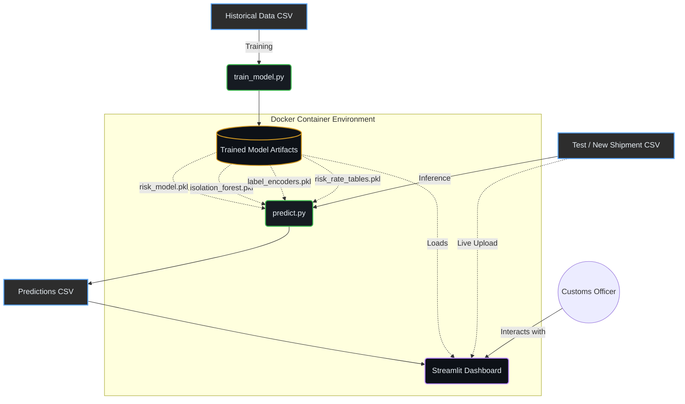
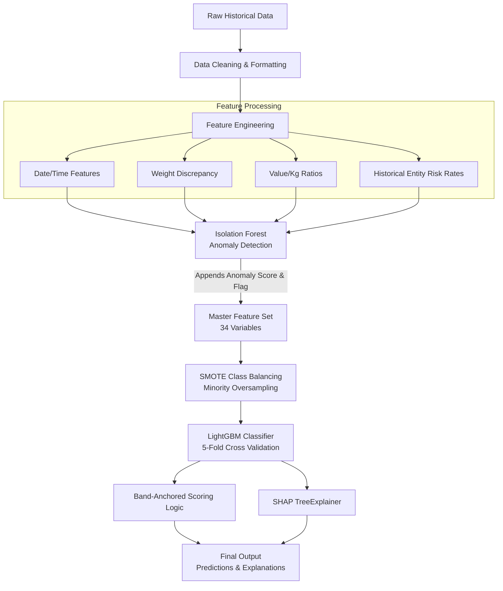
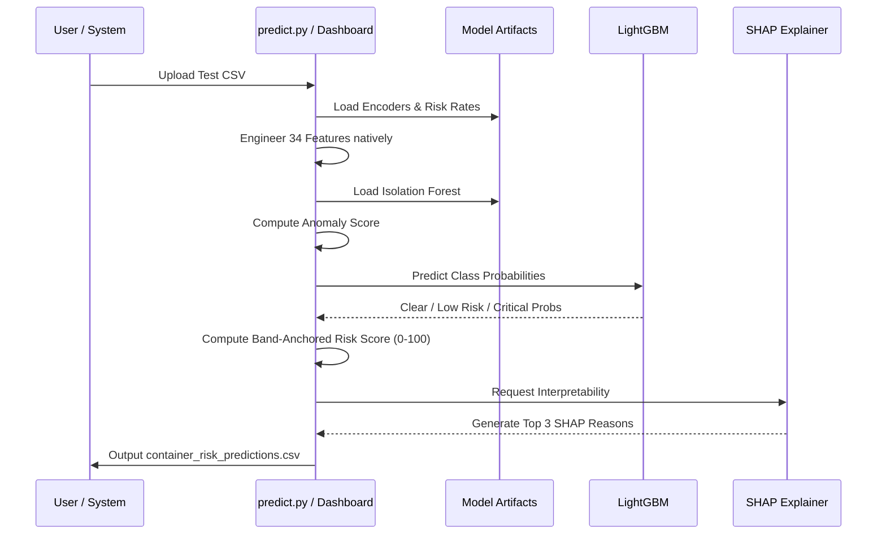
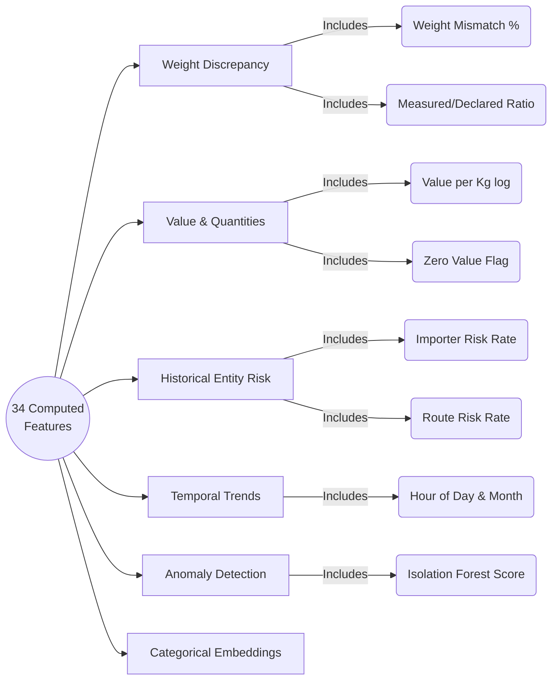
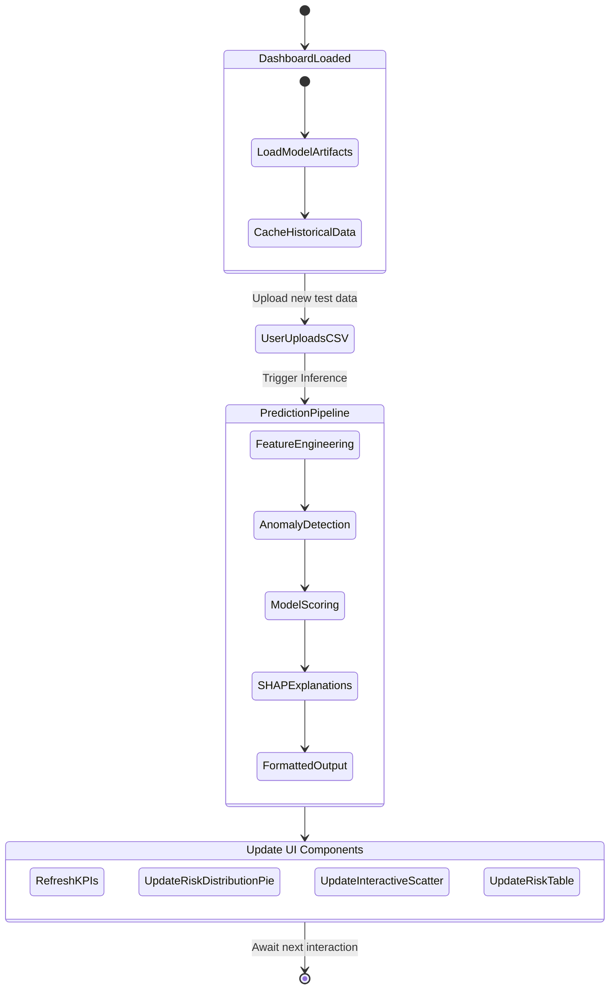

# 🚢 SmartContainer Risk Engine
### HackaMined 2026 — Track 9 INTECH | Team Submission

> **An end-to-end AI/ML system for intelligent container shipment risk scoring, anomaly detection, and real-time inspection prioritization — powered by LightGBM, SHAP Explainability, and Docker.**

---

## 📋 Table of Contents

1. [Project Overview](#1-project-overview)
2. [Problem Statement](#2-problem-statement)
3. [System Architecture](#3-system-architecture)
4. [Project File Structure](#4-project-file-structure)
5. [Technology Stack](#5-technology-stack)
6. [Data Description](#6-data-description)
7. [ML Pipeline — Step-by-Step Breakdown](#7-ml-pipeline--step-by-step-breakdown)
   - [Step 1: Data Loading & Cleaning](#step-1-data-loading--cleaning)
   - [Step 2: Feature Engineering (34 Features)](#step-2-feature-engineering-34-features)
   - [Step 3: Isolation Forest Anomaly Detection](#step-3-isolation-forest-anomaly-detection)
   - [Step 4: Class Imbalance Handling with SMOTE](#step-4-class-imbalance-handling-with-smote)
   - [Step 5: LightGBM Model Training (5-Fold CV)](#step-5-lightgbm-model-training-5-fold-cv)
   - [Step 6: Band-Anchored Risk Scoring (0–100)](#step-6-band-anchored-risk-scoring-0100)
   - [Step 7: SHAP Explainability](#step-7-shap-explainability)
8. [Risk Classification Logic](#8-risk-classification-logic)
9. [Dashboard Sections & Features](#9-dashboard-sections--features)
10. [How to Run — Local (Without Docker)](#10-how-to-run--local-without-docker)
    - [Prerequisites](#prerequisites)
    - [Step-by-Step Local Setup](#step-by-step-local-setup)
    - [Step 1: Clone / Download the Project](#step-1-clone--download-the-project)
    - [Step 2: Create a Virtual Environment](#step-2-create-a-virtual-environment)
    - [Step 3: Install Dependencies](#step-3-install-dependencies)
    - [Step 4: Train the Model](#step-4-train-the-model)
    - [Step 5: Run Predictions on Test Data](#step-5-run-predictions-on-test-data)
    - [Step 6: Launch the Dashboard](#step-6-launch-the-dashboard)
11. [How to Run — Docker (Recommended)](#11-how-to-run--docker-recommended)
    - [Prerequisites for Docker](#prerequisites-for-docker)
    - [Method A: Docker Compose (Easiest)](#method-a-docker-compose-easiest)
    - [Method B: Manual Docker Build & Run](#method-b-manual-docker-build--run)
12. [Command-Line Inference (predict.py)](#12-command-line-inference-predictpy)
13. [Model Artifacts Explained](#13-model-artifacts-explained)
14. [Evaluation Metrics](#14-evaluation-metrics)
15. [Dashboard Usage Guide](#15-dashboard-usage-guide)
16. [Troubleshooting](#16-troubleshooting)
17. [Key Design Decisions & Important Notes](#17-key-design-decisions--important-notes)

---

## 1. Project Overview

The **SmartContainer Risk Engine** is a complete, production-ready AI system designed for customs authorities and port operators to:

- **Automatically score** each incoming container shipment with a continuous risk score (0–100)
- **Classify** every shipment into one of three risk bands: 🔴 **Critical**, 🟡 **Low Risk**, or 🟢 **Clear**
- **Detect anomalies** in weight declarations, values, and behavioral patterns using unsupervised learning
- **Explain every prediction** in plain English using SHAP (SHapley Additive exPlanations)
- **Visualize** all analytics through a dark-themed, interactive Streamlit web dashboard

The system is fully containerized with Docker and includes a pre-trained model so the dashboard can start immediately without requiring re-training.

---

## 2. Problem Statement

Customs authorities face the challenge of manually inspecting millions of container shipments while having limited manpower and time. Most shipments are legitimate, but a small fraction contain fraudulent declarations, under-valued goods, or smuggled contents. Randomly selecting containers for inspection is inefficient.

**The solution:** Use historical inspection data to train a machine learning model that assigns a risk score to every incoming shipment, enabling customs officers to prioritize inspections on high-risk containers while letting low-risk shipments pass through faster.

---

## 3. System Architecture & Workflows

Below are the architectural and workflow diagrams detailing how the SmartContainer Risk Engine operates.

### 3.1. High-Level System Architecture

*(AI Conceptual System Architecture Diagram)*




### 3.2. ML Training Workflow

*(AI Conceptual Training Workflow)*



### 3.3. Risk Prediction / Inference Flow

*(AI Conceptual Inference Flow)*




### 3.4. Feature Engineering Structure

*(AI Conceptual Feature Diagram)*




### 3.5. Dashboard Data Flow

*(AI Conceptual Dashboard Data Flow)*




---

## 4. Project File Structure

```
HackaMined_B_Updated/
│
├── 📄 train_model.py               # Full training pipeline (run once to train)
├── 📄 predict.py                   # CLI inference script for new shipment CSVs
├── 📄 dashboard.py                 # Streamlit interactive web dashboard (1462 lines)
├── 📄 requirements.txt             # Python package dependencies
│
├── 🐳 Dockerfile                   # Docker image definition (Python 3.11-slim)
├── 🐳 docker-compose.yml           # One-command Docker deployment
├── 📄 .dockerignore                # Files excluded from Docker build context
│
├── 📊 Historical Data.csv          # Training dataset (~6.4 MB, primary source)
├── 📊 Test Data.csv                # Test/inference dataset (~1 MB)
├── 📊 my_test_results.csv          # Pre-computed predictions for Test Data.csv
├── 📊 container_risk_predictions.csv  # Predictions from training data
│
├── 🤖 risk_model.pkl               # Saved LightGBM model (~10 MB)
├── 🤖 isolation_forest.pkl         # Saved Isolation Forest model (~3.5 MB)
├── 🤖 label_encoders.pkl           # Saved LabelEncoder objects (~278 KB)
└── 🤖 risk_rate_tables.pkl         # Entity risk rate lookup tables (~568 KB)
```

> **Note:** The `.pkl` model files are pre-trained and included in the project. You do **not** need to run `train_model.py` to use the dashboard — it works immediately out of the box.

---

## 5. Technology Stack

| Category | Library / Tool | Version | Purpose |
|---|---|---|---|
| **ML Framework** | LightGBM | Latest | Gradient Boosting Classifier |
| **Anomaly Detection** | scikit-learn (IsolationForest) | Latest | Unsupervised anomaly detection |
| **Class Balancing** | imbalanced-learn (SMOTE) | Latest | Synthetic minority oversampling |
| **Explainability** | SHAP | Latest | TreeExplainer — feature importance |
| **Data Processing** | Pandas, NumPy | Latest | Data manipulation and feature engineering |
| **Model Persistence** | joblib | Latest | Saving/loading model artifacts |
| **Web Dashboard** | Streamlit | Latest | Interactive data web application |
| **Charts** | Plotly Express & Graph Objects | Latest | Interactive visualizations |
| **Containerization** | Docker + Docker Compose | Latest | Reproducible deployment |
| **Python** | Python | 3.11 | Runtime environment |

---

## 6. Data Description

### Historical Data.csv (Training Data)
The primary training dataset containing historical container shipment records with their known inspection outcomes.

| Column Name | Type | Description |
|---|---|---|
| `Container_ID` | String | Unique identifier for each container |
| `Declaration_Date` | Date (YYYY-MM-DD) | Date of customs declaration |
| `Declaration_Time` | Time (HH:MM:SS) | Time of customs declaration |
| `Origin_Country` | Categorical | Country of origin |
| `Destination_Country` | Categorical | Destination country |
| `Destination_Port` | Categorical | Target port of arrival |
| `Shipping_Line` | Categorical | Carrier/shipping company name |
| `Importer_ID` | Categorical | Unique importer identifier |
| `Exporter_ID` | Categorical | Unique exporter identifier |
| `HS_Code` | Integer | Harmonized System commodity code |
| `Trade_Regime` | Categorical | Import / Export / Transit |
| `Declared_Weight` | Float | Weight declared in customs documents (kg) |
| `Measured_Weight` | Float | Physically measured/scanned weight (kg) |
| `Declared_Value` | Float | Declared customs value (USD) |
| `Dwell_Time_Hours` | Float | Time spent at port (hours) |
| `Clearance_Status` | Categorical | **Target label**: Clear / Low Risk / Critical |

### Test Data.csv (Inference Data)
Same schema as Historical Data.csv (may or may not include `Clearance_Status` for evaluation).

### Output CSV Format (Predictions)

| Column | Description |
|---|---|
| `Container_ID` | Container identifier (matches input) |
| `Risk_Score` | Continuous risk score from 0 to 100 |
| `Risk_Level` | Classification: Critical / Low Risk / Clear |
| `Explanation_Summary` | Top 3 plain-English SHAP-based reasons |

---

## 7. ML Pipeline — Step-by-Step Breakdown

### Step 1: Data Loading & Cleaning

**File:** `train_model.py` (Lines 55–64)

```python
df = pd.read_csv("Historical Data.csv")
df.columns = [c.strip() for c in df.columns]  # strip whitespace from column names
df.rename(columns={
    "Declaration_Date (YYYY-MM-DD)": "Declaration_Date",
    "Trade_Regime (Import / Export / Transit)": "Trade_Regime",
}, inplace=True)
```

- CSV is loaded and column names are normalized (whitespace removed)
- Two verbose column names are aliased to shorter, cleaner names
- No rows are dropped — all missing values are handled downstream

---

### Step 2: Feature Engineering (34 Features)

**File:** `train_model.py` (Lines 69–165)

This is the heart of the system. Raw CSV columns are transformed into 34 informative model features grouped into 7 categories:

#### 2a. Date/Time Features
```
hour_of_day    — Hour of customs declaration (0–23); night declarations flag risk
day_of_week    — 0=Monday to 6=Sunday; weekend declarations can be anomalous
month          — Month number; captures seasonal risk patterns
year           — Year; for temporal trend modeling
```

#### 2b. Weight Discrepancy Features
```
weight_diff_abs        — Absolute difference: Measured_Weight - Declared_Weight
weight_diff_pct        — Percentage discrepancy: (diff / declared) × 100
weight_mismatch_flag   — Binary: 1 if |diff_pct| > 5%
weight_mismatch_severe — Binary: 1 if |diff_pct| > 15%
weight_ratio           — Measured / Declared weight ratio
```
> Weight discrepancy is the single most important fraud indicator. Smugglers typically declare less weight to reduce duties.

#### 2c. Value Features
```
value_per_kg        — Declared value normalized by weight; detects over/under-valuation
log_declared_value  — Log-transform of declared value (handles extreme outliers)
log_declared_weight — Log-transform of declared weight
log_measured_weight — Log-transform of measured weight
log_dwell_time      — Log-transform of dwell time (hours at port)
log_value_per_kg    — Log-transform of value per kg ratio
zero_value_flag     — Binary: 1 if Declared_Value == 0 (suspicious)
```

#### 2d. HS Code Chapter
```
hs_chapter — First 2 digits of HS code ÷ 10000 = commodity chapter
             Certain chapters (e.g., electronics, chemicals, weapons) are high-risk
```

#### 2e. Trade Regime Flag
```
is_transit — Binary: 1 if Trade_Regime == "Transit"
             Transit shipments bypass full inspection and carry higher inherent risk
```

#### 2f. Entity Risk Rates (Smoothed Historical Risk Rates)
This is the most sophisticated feature group. For each high-cardinality entity (importer, exporter, country, port, shipping line, route), the system calculates a **smoothed historical critical rate**:

```python
rate = (critical_count + smooth × global_rate) / (total_count + smooth)
```

The smoothing factor (`smooth=10`) prevents overfitting on entities with few historical records by pulling their rate toward the global average.

```
importer_risk_rate      — Historical critical-shipment rate for this importer
exporter_risk_rate      — Historical critical-shipment rate for this exporter
country_risk_rate       — Historical critical-shipment rate for origin country
port_risk_rate          — Historical critical-shipment rate for destination port
shipping_line_risk_rate — Historical critical-shipment rate for this carrier
dest_country_risk_rate  — Historical critical-shipment rate for destination country
route_risk_rate         — Historical critical-shipment rate for this specific route
entity_risk_combined    — Weighted composite of all entity rates:
                          0.30×importer + 0.20×exporter + 0.15×country
                          + 0.10×port + 0.10×shipping_line
                          + 0.10×dest_country + 0.05×route
```

These entity risk tables are saved to `risk_rate_tables.pkl` and reused during inference so predictions on new data use training-time risk rates (no data leakage).

#### 2g. Label Encoding for High-Cardinality Categoricals
```
Origin_Country_enc        categorical → integer
Destination_Country_enc   categorical → integer
Destination_Port_enc      categorical → integer
Shipping_Line_enc         categorical → integer
Importer_ID_enc           categorical → integer
Exporter_ID_enc           categorical → integer
```
LabelEncoders are saved to `label_encoders.pkl` and applied identically at inference time. Unseen categories at inference return `-1`.

---

### Step 3: Isolation Forest Anomaly Detection

**File:** `train_model.py` (Lines 170–193)

```python
iso = IsolationForest(
    n_estimators=300,
    contamination=0.05,   # expect ~5% anomalies
    max_samples="auto",
    random_state=42,
    n_jobs=-1
)
iso.fit(df[iso_features])
df["anomaly_score"] = -iso.score_samples(df[iso_features])  # higher = more anomalous
df["is_anomaly"]    = (iso.predict(df[iso_features]) == -1).astype(int)
```

**How Isolation Forest works:**
- Builds 300 decision trees that randomly isolate data points
- Anomalous samples (unusual patterns) are isolated in fewer splits → shorter path length
- The `anomaly_score` is the **negative** mean path length (higher = more anomalous)
- `is_anomaly` is a binary flag derived from the 5% contamination threshold

**Features used for anomaly detection (13 features):**
```
log_declared_value, log_declared_weight, log_measured_weight,
weight_diff_pct, weight_ratio, log_dwell_time, log_value_per_kg,
hour_of_day, hs_chapter, importer_risk_rate, exporter_risk_rate,
country_risk_rate, is_transit
```

Both `anomaly_score` and `is_anomaly` are added as features to the LightGBM model AND used in the risk score formula.

---

### Step 4: Class Imbalance Handling with SMOTE

**File:** `train_model.py` (Lines 253–258)

Real-world customs data is highly imbalanced: most shipments are `Clear`, with far fewer `Critical` cases.

```python
smote = SMOTE(
    sampling_strategy="not majority",  # oversample minority classes to ~50% of majority
    k_neighbors=5,
    random_state=42,
)
X_tr_res, y_tr_res = smote.fit_resample(X_tr, y_tr)
```

SMOTE (Synthetic Minority Over-sampling TEchnique) creates **synthetic** training examples for minority classes by interpolating between existing minority samples. This ensures the model learns to detect `Critical` and `Low Risk` cases even when they are underrepresented.

> SMOTE is applied **only to training folds** during cross-validation (never to the validation fold) to prevent data leakage.

---

### Step 5: LightGBM Model Training (5-Fold Cross-Validation)

**File:** `train_model.py` (Lines 231–335)

#### LightGBM Hyperparameters

```python
lgb_params = dict(
    objective        = "multiclass",   # 3-class classification
    num_class        = 3,              # Clear=0, Low Risk=1, Critical=2
    n_estimators     = 1200,           # max 1200 boosting rounds
    learning_rate    = 0.04,           # slow, stable learning
    num_leaves       = 63,             # controls model complexity
    max_depth        = 8,              # prevents deep overfitting trees
    min_child_samples= 10,             # min samples per leaf
    subsample        = 0.8,            # 80% row sampling per tree
    colsample_bytree = 0.8,            # 80% feature sampling per tree
    reg_alpha        = 0.1,            # L1 regularization
    reg_lambda       = 0.1,            # L2 regularization
    class_weight     = "balanced",     # additional class weighting
    random_state     = 42,
    n_jobs           = -1,             # use all CPU cores
)
```

#### 5-Fold Stratified Cross-Validation
- Data is split into 5 folds maintaining class proportions (`StratifiedKFold`)
- SMOTE applied to each training fold
- Early stopping: training halts if validation Macro F1 doesn't improve for 60 rounds
- Metrics tracked per fold: **Macro F1**, **Critical F1**, **Critical Recall**

#### Final Model
After cross-validation, a final model is trained on the **entire training dataset** (with SMOTE) and saved to `risk_model.pkl`.

---

### Step 6: Band-Anchored Risk Scoring (0–100)

**File:** `train_model.py` (Lines 347–383)

This is a critical design innovation. Instead of using raw model probabilities directly as a risk score, the system uses a **band-anchored** approach:

**Step 6a: The model determines the BAND**
```
pred_class → Clear (0), Low Risk (1), or Critical (2)
Band ranges:  Clear: 2–20 | Low Risk: 23–53 | Critical: 56–98
```

**Step 6b: Continuous severity spreads the score within each band**
```python
severity = (
    0.35 × weight_mismatch_severity    +  # how extreme is the weight mismatch
    0.25 × entity_risk_combined        +  # how risky are the parties involved
    0.20 × normalized_anomaly_score    +  # how statistically unusual is this shipment
    0.20 × model_class_probability        # how confident is the model
)
```

**Step 6c: Map severity to within-band range**
```
final_risk_score = band_min + severity × (band_max - band_min)
```

**Why this approach?**
- Prevents the impossible scenario where a "Low Risk" container scores 90 (which would be in the Critical band)
- Maintains full 0–100 range for human interpretability
- Preserves within-band relative ordering so the highest-risk "Critical" containers can still be ranked amongst themselves

---

### Step 7: SHAP Explainability

**File:** `train_model.py` (Lines 388–522)

```python
explainer    = shap.TreeExplainer(final_model)
shap_values  = explainer.shap_values(X)  # shape: [3 classes] × [n_samples × 34 features]
```

For each container, SHAP computes how much each of the 34 features **contributed** to the model's prediction.

**Plain-English Conversion:**
The top 3 features with the **highest positive SHAP values** (features that *pushed toward* the predicted risk level) are mapped to human-readable sentences via a lookup dictionary:

```python
# Example mappings:
("weight_diff_pct",     "HIGH") → "Declared weight is more than 5% off from the measured weight"
("importer_risk_rate",  "HIGH") → "This importer has a history of flagged or seized shipments"
("anomaly_score",       "HIGH") → "Shipment shows highly unusual patterns compared to normal traffic"
("is_transit",          "HIGH") → "Shipment is in transit regime, which carries inherently higher risk"
```

Only **positive** SHAP features are included — this ensures explanations always describe *why* a shipment received the assigned risk level, never contradictory information.

**Output example:**
```
"Declared weight is more than 5% off from the measured weight;
 This trade route has a high incidence of flagged shipments;
 Shipment has been flagged as a statistical anomaly"
```

---

## 8. Risk Classification Logic

| Risk Score Range | Risk Level | Meaning |
|---|---|---|
| **56 – 98** | 🔴 **Critical** | High probability of fraud, contraband, or significant misdeclaration. Prioritize for physical inspection. |
| **23 – 53** | 🟡 **Low Risk** | Some suspicious indicators present. Secondary review recommended. |
| **2 – 20** | 🟢 **Clear** | No significant risk indicators. Routine processing. |

**Thresholds used in scoring:**
- `CRITICAL_THRESH = 55` — score ≥ 55 → Critical
- `LOW_RISK_THRESH = 22` — score ≥ 22 → Low Risk; score < 22 → Clear

---

## 9. Dashboard Sections & Features

**File:** `dashboard.py` (1,462 lines, Streamlit)

The dashboard has the following sections accessible via the main page (all with dark theme, responsive layout):

| Section | Description |
|---|---|
| **📤 Upload & Predict** | Upload any shipment CSV; live predictions run via SHAP + model; downloadable results CSV |
| **📊 System Overview** | 6 KPI cards: Total Containers, Critical, Low Risk, Clear, Avg Risk Score, Avg Dwell Time. Plus secondary metrics: weight anomalies, critical rate, max risk score, zero-value containers |
| **🎯 Risk Distribution** | Donut pie chart of risk level counts; Risk score histogram with threshold lines |
| **🌍 Trade Flow Analysis** | Top 15 Origin Countries bar chart; Top 15 Destination Ports bar chart |
| **🔬 Anomaly Detection** | Scatter: Declared vs Measured Weight colored by risk level; Histogram of weight mismatch % |
| **⏱️ Dwell Time Analysis** | Box plot of dwell time by risk level; Histogram with threshold lines |
| **📅 Time Series Trends** | Monthly shipment counts over time; Monthly average risk score trend |
| **🏆 Highest-Risk Containers** | Filterable table of top-N containers by risk score with explanations |
| **📋 Model Evaluation Metrics** | Precision, Recall, F1 per class; Macro/Weighted averages; Accuracy; Confusion matrix heatmap |

**Sidebar Filters** (apply globally to all charts):
- Risk Level (multi-select)
- Origin Country (multi-select)
- Destination Port (multi-select)
- Trade Regime (multi-select)
- Risk Score Range (slider 0–100)

---

## 10. How to Run — Local (Without Docker)

### Prerequisites

- **Python 3.9 or higher** (3.11 recommended for best compatibility)
- **pip** (Python package installer)
- **Git** (optional, for cloning)
- Minimum **4 GB RAM** (8 GB recommended for SHAP computation on large datasets)
- Minimum **2 GB free disk space**

### Step-by-Step Local Setup

#### Step 1: Clone / Download the Project

**Option A — Clone using Git:**
```bash
git clone <your-repo-url>
cd HackaMined_B_Updated
```

**Option B — Download ZIP:**
- Download and extract the project ZIP file
- Open a terminal/command prompt and navigate to the extracted folder:
```bash
cd "path\to\HackaMined_B_Updated"
```

> **IMPORTANT:** Make sure the following CSV files are present in the project root directory:
> - `Historical Data.csv`
> - `Test Data.csv`
> - `my_test_results.csv`
> - `container_risk_predictions.csv`

---

#### Step 2: Create a Virtual Environment

Creating a virtual environment isolates the project dependencies from your system Python.

**Windows:**
```bash
python -m venv venv
venv\Scripts\activate
```

**macOS / Linux:**
```bash
python3 -m venv venv
source venv/bin/activate
```

You should see `(venv)` appear at the start of your terminal prompt, confirming the virtual environment is active.

---

#### Step 3: Install Dependencies

```bash
pip install -r requirements.txt
```

This installs the following packages:
```
pandas          — Data manipulation
numpy           — Numerical computing
scikit-learn    — Isolation Forest, LabelEncoder, metrics, cross-validation
lightgbm        — Gradient boosting classifier
imbalanced-learn — SMOTE oversampling
shap            — SHAP explainability
joblib          — Model save/load
streamlit       — Dashboard web app
plotly          — Interactive charts
```

> **Note:** Installation may take 2–5 minutes depending on internet speed. LightGBM and SHAP are the largest packages.

**Verify installation:**
```bash
python -c "import lightgbm, shap, streamlit, plotly; print('All packages OK')"
```

---

#### Step 4: Train the Model

> **Skip this step if you already have the `.pkl` model files** (`risk_model.pkl`, `isolation_forest.pkl`, `label_encoders.pkl`, `risk_rate_tables.pkl`). The pre-trained models are included in the project.

If you want to retrain from scratch (e.g., with updated data):

```bash
python train_model.py
```

**What this command does:**
1. Loads `Historical Data.csv`
2. Engineers 34 features from raw columns
3. Trains Isolation Forest for anomaly detection (saved → `isolation_forest.pkl`)
4. Saves entity risk rate lookup tables (saved → `risk_rate_tables.pkl`)
5. Runs 5-fold stratified cross-validation with SMOTE + LightGBM
6. Trains final model on full dataset (saved → `risk_model.pkl`)
7. Saves label encoders (saved → `label_encoders.pkl`)
8. Computes SHAP explanations
9. Saves predictions to `container_risk_predictions.csv`

**Expected output during training:**
```
============================================================
SmartContainer Risk Engine - Training Pipeline
============================================================

[1/7] Loading data from 'Historical Data.csv' ...
      Shape: (XXXXX, 16)

[2/7] Feature engineering ...
      Computing entity risk rates ...
      Label-encoding categoricals ...
      Saved risk_rate_tables.pkl

[3/7] Isolation Forest anomaly detection ...
      Anomalies detected: XXXX (5.0%)

[4/7] Stratified 5-Fold Cross-Validation ...
      Fold 1: Macro F1=X.XXXX  F1_Critical=X.XXXX  Recall_Critical=X.XXXX
      Fold 2: Macro F1=X.XXXX  F1_Critical=X.XXXX  Recall_Critical=X.XXXX
      Fold 3: Macro F1=X.XXXX  F1_Critical=X.XXXX  Recall_Critical=X.XXXX
      Fold 4: Macro F1=X.XXXX  F1_Critical=X.XXXX  Recall_Critical=X.XXXX
      Fold 5: Macro F1=X.XXXX  F1_Critical=X.XXXX  Recall_Critical=X.XXXX

[5/7] Training final model on full dataset ...

[6/7] Computing Risk Scores and SHAP explanations ...

[7/7] Saving predictions to 'container_risk_predictions.csv' ...
============================================================
Training Complete!
============================================================
```

> **Training time:** Approximately 5–15 minutes depending on hardware. SHAP computation on the full dataset takes the most time.

---

#### Step 5: Run Predictions on Test Data

```bash
python predict.py --input "Test Data.csv" --output my_test_results.csv
```

**Command-line options:**

| Option | Default | Description |
|---|---|---|
| `--input` | *(required)* | Path to the input shipment CSV file |
| `--output` | `container_risk_predictions.csv` | Output CSV file path |
| `--critical-threshold` | `55.0` | Risk score threshold for "Critical" classification |
| `--low-risk-threshold` | `22.0` | Risk score threshold for "Low Risk" classification |
| `--no-shap` | False | Skip SHAP computation (much faster, no explanations) |

**For faster inference (no SHAP):**
```bash
python predict.py --input "Test Data.csv" --output my_test_results.csv --no-shap
```

**Evaluation against ground truth** (if `Test Data.csv` contains `Clearance_Status`):
```bash
python predict.py --input "Test Data.csv"
# The script auto-detects Clearance_Status column and prints metrics
```

---

#### Step 6: Launch the Dashboard

```bash
streamlit run dashboard.py
```

After a few seconds, Streamlit will output:
```
  You can now view your Streamlit app in your browser.
  Local URL: http://localhost:8501
  Network URL: http://192.168.x.x:8501
```

Open your web browser and navigate to **http://localhost:8501**

The dashboard will automatically load:
- `Historical Data.csv` for historical context
- `my_test_results.csv` for pre-computed predictions and evaluation metrics

---

## 11. How to Run — Docker (Recommended)

Docker provides a completely isolated, reproducible environment with all dependencies pre-installed. No Python setup required on your machine.

### Prerequisites for Docker

1. **Install Docker Desktop:**
   - Windows/Mac: Download from [https://www.docker.com/products/docker-desktop](https://www.docker.com/products/docker-desktop)
   - Ubuntu/Linux: `sudo apt-get install docker.io docker-compose`

2. **Verify Docker is running:**
   ```bash
   docker --version
   docker compose version
   ```

3. **Ensure these files are present** in the project directory (they're mounted as volumes):
   - `Historical Data.csv`
   - `Test Data.csv`
   - `my_test_results.csv`
   - `container_risk_predictions.csv`

---

### Method A: Docker Compose (Easiest)

This is the **recommended** method. One command builds and starts everything.

**First-time run (builds Docker image):**
```bash
docker compose up --build
```

**Subsequent runs (starts fast, no rebuild):**
```bash
docker compose up
```

**Stop the container:**
```bash
docker compose down
```

**What happens:**
1. Docker reads `Dockerfile` and builds a `python:3.11-slim` image
2. Installs all packages from `requirements.txt`
3. Copies Python scripts and pre-trained `.pkl` model files into the image
4. Mounts the CSV data files from your local disk as read-only volumes
5. Exposes port `8501` on your machine
6. Starts `streamlit run dashboard.py` as the default command
7. Health check runs every 30s to ensure the service is alive

**Access the dashboard:**
Open your browser and go to **http://localhost:8501**

---

### Method B: Manual Docker Build & Run

Use this if you prefer more control over Docker commands.

**Step 1: Build the image:**
```bash
docker build -t smartcontainer-risk-engine:latest .
```

**Step 2: Run the container:**
```bash
docker run -p 8501:8501 \
  -v "$(pwd)/Historical Data.csv:/app/Historical Data.csv:ro" \
  -v "$(pwd)/Test Data.csv:/app/Test Data.csv:ro" \
  -v "$(pwd)/my_test_results.csv:/app/my_test_results.csv:ro" \
  -v "$(pwd)/container_risk_predictions.csv:/app/container_risk_predictions.csv:ro" \
  --name smartcontainer-risk-engine \
  smartcontainer-risk-engine:latest
```

**On Windows (PowerShell), use `${PWD}` instead:**
```powershell
docker run -p 8501:8501 `
  -v "${PWD}/Historical Data.csv:/app/Historical Data.csv:ro" `
  -v "${PWD}/Test Data.csv:/app/Test Data.csv:ro" `
  -v "${PWD}/my_test_results.csv:/app/my_test_results.csv:ro" `
  -v "${PWD}/container_risk_predictions.csv:/app/container_risk_predictions.csv:ro" `
  --name smartcontainer-risk-engine `
  smartcontainer-risk-engine:latest
```

**Stop and remove the container:**
```bash
docker stop smartcontainer-risk-engine
docker rm smartcontainer-risk-engine
```

**View container logs:**
```bash
docker logs smartcontainer-risk-engine
# or follow live:
docker logs -f smartcontainer-risk-engine
```

---

### Docker Environment Variables

The following environment variables are pre-configured in both `Dockerfile` and `docker-compose.yml`:

| Variable | Value | Purpose |
|---|---|---|
| `STREAMLIT_SERVER_PORT` | `8501` | Port Streamlit listens on |
| `STREAMLIT_SERVER_ADDRESS` | `0.0.0.0` | Bind to all network interfaces |
| `STREAMLIT_SERVER_HEADLESS` | `true` | Disable browser auto-open |
| `STREAMLIT_BROWSER_GATHER_USAGE_STATS` | `false` | Opt out of telemetry |
| `PYTHONDONTWRITEBYTECODE` | `1` | No `.pyc` files |
| `PYTHONUNBUFFERED` | `1` | Real-time log output |

---

## 12. Command-Line Inference (predict.py)

`predict.py` is a standalone inference script that can score any shipment CSV file using the saved model artifacts.

### Full Usage

```bash
python predict.py --input "path/to/shipment_data.csv" \
                  --output "path/to/output_predictions.csv" \
                  --critical-threshold 55 \
                  --low-risk-threshold 22
```

### Quick Examples

```bash
# Basic usage with defaults
python predict.py --input "Test Data.csv"

# Custom output file
python predict.py --input "Test Data.csv" --output my_predictions.csv

# Fast inference without SHAP (no explanations, much faster)
python predict.py --input "Test Data.csv" --output fast_results.csv --no-shap

# Custom risk thresholds (be more aggressive in flagging Critical)
python predict.py --input "Test Data.csv" --critical-threshold 45 --low-risk-threshold 18
```

### What `predict.py` Does Internally

1. **Validates** that all 4 required `.pkl` files exist
2. **Loads** the model, encoders, isolation forest, and risk rate tables
3. **Loads and cleans** the input CSV (normalizes column names)
4. **Engineers features** — same 34 features as training (using saved lookup tables)
5. **Applies Isolation Forest** — computes `anomaly_score` and `is_anomaly`
6. **Runs LightGBM** — gets class probabilities for all 3 classes
7. **Computes band-anchored risk scores** and assigns risk levels
8. **Runs SHAP TreeExplainer** and generates plain-English explanations
9. **Prints evaluation metrics** if `Clearance_Status` column is present in input
10. **Saves output CSV** with Container_ID, Risk_Score, Risk_Level, Explanation_Summary

---

## 13. Model Artifacts Explained

| File | Size | Contents | Required By |
|---|---|---|---|
| `risk_model.pkl` | ~10 MB | Trained `LGBMClassifier` object | `predict.py`, `dashboard.py` |
| `isolation_forest.pkl` | ~3.5 MB | Trained `IsolationForest` object | `predict.py`, `dashboard.py` |
| `label_encoders.pkl` | ~278 KB | Dict of `LabelEncoder` per categorical column | `predict.py`, `dashboard.py` |
| `risk_rate_tables.pkl` | ~568 KB | Dict of entity → historical risk rate mappings | `predict.py`, `dashboard.py` |

> All 4 files must be present in the same directory as the scripts. They are generated by `train_model.py` and are pre-included in this submission.

---

## 14. Evaluation Metrics

The system evaluates model performance using the following metrics (computed when `Clearance_Status` is available):

| Metric | Why It Matters |
|---|---|
| **Macro F1-Score** | Primary metric: equal weight to all 3 classes regardless of size |
| **Critical F1-Score** | Most important: ability to correctly identify high-risk shipments |
| **Critical Recall** | Fraction of actual Critical cases that are caught (missing one is costly) |
| **Weighted F1-Score** | F1 weighted by class support |
| **Accuracy** | Overall correct classification rate |
| **Confusion Matrix** | Per-class breakdown: True Positives, False Positives, False Negatives |

### Where to See Metrics

1. **Terminal:** After running `python predict.py --input "Test Data.csv"` (if `Clearance_Status` is present)
2. **Dashboard:** Scroll to the "📋 Model Evaluation Metrics" section

---

## 15. Dashboard Usage Guide

### Uploading New Data for Prediction

1. On the dashboard main page, find the **"📤 Upload Shipment Data & Run Predictions"** section
2. Click **"Choose a shipment CSV"** and select your file
3. Click **"🔍 Run Predictions"**
4. Wait ~60–240 seconds for feature engineering + SHAP to complete
5. All charts on the page will automatically refresh with predictions from your uploaded file
6. Click **"⬇️ Download Results CSV"** to save the predictions

> The uploaded CSV must have the **same column schema** as `Test Data.csv` / `Historical Data.csv`.

### Using Sidebar Filters

The sidebar filters apply **globally** to all charts simultaneously:

- **Risk Level:** Select which risk levels to include (e.g., only show Critical containers)
- **Origin Country:** Filter to specific country/countries of origin
- **Destination Port:** Filter to specific destination ports
- **Trade Regime:** Filter by Import / Export / Transit
- **Risk Score Range:** Slider to narrow by risk score value (e.g., 80–100 for top critical)

### Resetting to Default View

Simply reload the page (`F5`) to reset all filters and return to the default view using pre-computed `my_test_results.csv` predictions.

---

## 16. Troubleshooting

### ❌ `FileNotFoundError: Required file not found: risk_model.pkl`
**Cause:** Model artifacts are missing.
**Fix:** Either run `python train_model.py` or ensure the `.pkl` files are in the same directory as your scripts.

### ❌ `FileNotFoundError: [Errno 2] No such file or directory: 'Historical Data.csv'`
**Cause:** CSV data files are not in the project directory.
**Fix:** Ensure `Historical Data.csv`, `Test Data.csv`, `my_test_results.csv`, and `container_risk_predictions.csv` are in the same folder as the Python scripts.

### ❌ `ModuleNotFoundError: No module named 'lightgbm'`
**Cause:** Dependencies not installed or virtual environment not activated.
**Fix:**
```bash
# Activate virtual environment first:
venv\Scripts\activate       # Windows
source venv/bin/activate    # Mac/Linux
# Then install:
pip install -r requirements.txt
```

### ❌ Dashboard shows blank/empty charts
**Cause:** `my_test_results.csv` might be empty or malformed.
**Fix:** Regenerate it:
```bash
python predict.py --input "Test Data.csv" --output my_test_results.csv --no-shap
```

### ❌ Docker: `Cannot connect to the Docker daemon`
**Cause:** Docker Desktop is not running.
**Fix:** Start Docker Desktop from your system tray or applications folder, wait for it to fully start (the Docker icon should stop animating), then retry.

### ❌ Docker: Port 8501 already in use
**Cause:** Another Streamlit instance or application is using port 8501.
**Fix:** Either stop the other application, or map to a different port:
```bash
docker run -p 8502:8501 ... # map host port 8502 to container port 8501
# then access http://localhost:8502
```

### ❌ `SHAP computation hanging or very slow`
**Cause:** SHAP TreeExplainer on large datasets is CPU-intensive.
**Fix 1:** Use `--no-shap` flag when running `predict.py`:
```bash
python predict.py --input "Test Data.csv" --no-shap
```
**Fix 2:** For the dashboard upload prediction, be patient — it can take 2–4 minutes on a large CSV.

### ❌ Training very slow on Windows
**Cause:** LightGBM's multiprocessing can be slow on Windows for certain configurations.
**Fix:** The training uses `n_jobs=-1` (all cores), which is optimal. Ensure no other heavy processes are running. Using WSL2 (Windows Subsystem for Linux) can speed up training significantly.

---

## 17. Key Design Decisions & Important Notes

### 1. Why LightGBM over XGBoost or Random Forest?
LightGBM is optimized for tabular data with categorical features. It trains faster, uses less memory, and typically achieves better accuracy than alternatives on structured data. Its native handling of class imbalance (`class_weight="balanced"`) also makes it well-suited for this task.

### 2. Why SMOTE instead of just `class_weight`?
Using both SMOTE (oversampling) and `class_weight="balanced"` provides double correction for class imbalance. SMOTE generates synthetic samples that teach the model the shape of minority class decision boundaries, while `class_weight` increases the penalty for misclassifying minority class examples.

### 3. Why Smoothed Entity Risk Rates vs. Raw Rates?
With Bayesian smoothing (`smooth=10`), new or rare entities (e.g., an importer with only 1 shipment) get pulled toward the global average rate rather than being assigned an extreme rate. This prevents the model from over-relying on sparse historical data.

### 4. Why Band-Anchored Scoring vs. Raw Probabilities?
Raw model probabilities don't map naturally to a 0–100 scale in a meaningful way. The band-anchored approach guarantees:
- A "Clear" container always scores between 2–20
- A "Low Risk" container always scores between 23–53  
- A "Critical" container always scores between 56–98
- Within each band, more severe cases score higher

### 5. Only Positive SHAP for Explanations
Including negative SHAP values (features that *argued against* a risk level) would confuse operators. E.g., explaining a Critical container with "the declared value is low" contradicts the risk level. By using only positive-SHAP features, every explanation clearly states **why** the container received that specific risk level.

### 6. CSV Files as Docker Volumes
Rather than baking CSV data files into the Docker image, they are mounted as read-only volumes. This means:
- You can update/swap CSVs without rebuilding the image
- The Docker image stays lean (only code and model files are embedded)
- Sensitive data doesn't get committed to a container registry

### 7. Dashboard Uses `my_test_results.csv` by Default
The dashboard loads `my_test_results.csv` (predictions on `Test Data.csv`) at startup. When you upload a new CSV and click "Run Predictions", the dashboard temporarily switches to showing results for the uploaded file (stored in Streamlit's session state). Refreshing the page reverts to the default view.

---

## 📜 License

This project was developed for **HackaMined 2026 — Track 8 INTECH** academic competition. All rights reserved by the team.

---

## 👥 Team

**HackaMined 2026 — Track 8 INTECH**

---

*README last updated: March 2026*
